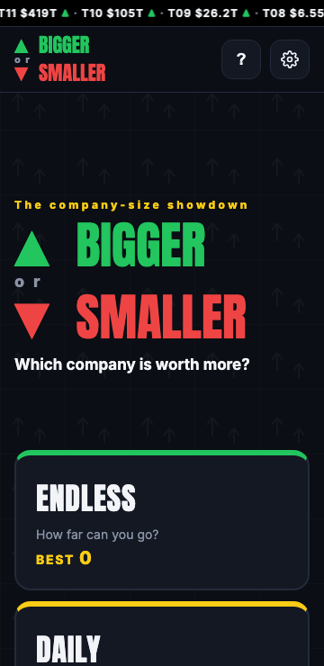
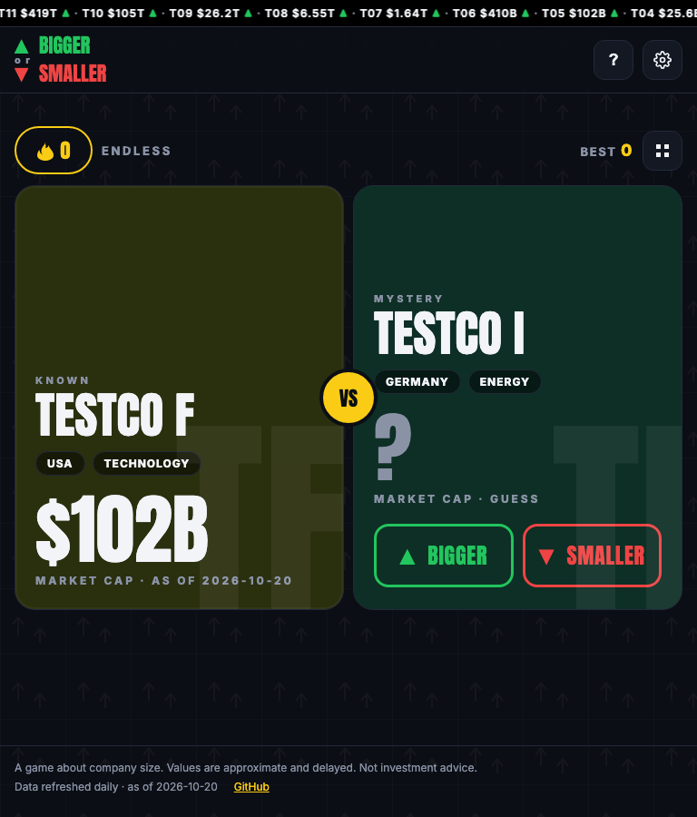
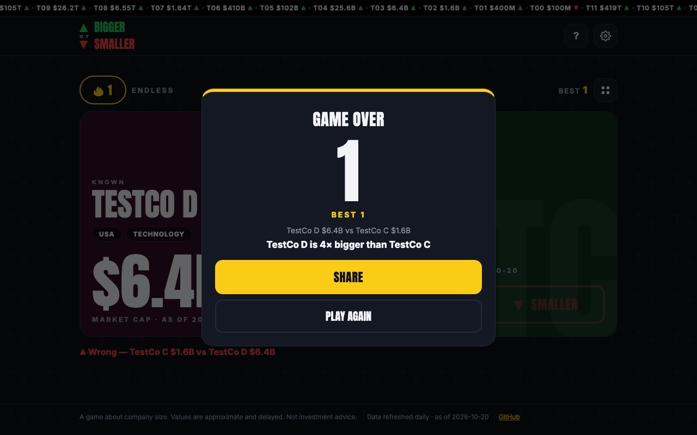

# Bigger or Smaller — Which company is worth more?

A free showdown game: guess whether the next company is **▲ bigger** or **▼ smaller**, build your streak, and try the Daily 10 — same pairs for everyone, one attempt per day.

Live URL: https://ap0l1on.github.io/BiggerOrSmaller/

## Screenshots

| Home | Mid-game | Game over |
| --- | --- | --- |
|  |  |  |

## How the values are made

Every value is a real market cap, fetched daily from public Yahoo Finance data by a GitHub Action and converted to USD — never hand-typed. Best scores live in your browser (`localStorage`): no accounts, no cookies.

## Analytics

Cookieless visitor counts by Cloudflare Web Analytics.

## Disclaimer

A game about company size. Values are approximate and delayed. Not investment advice.
